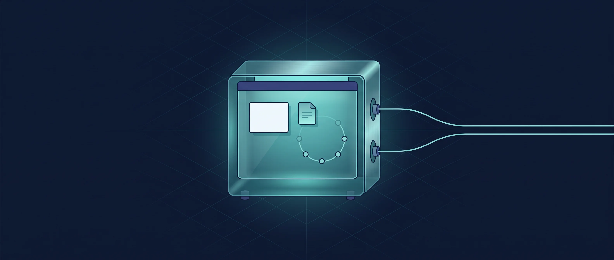
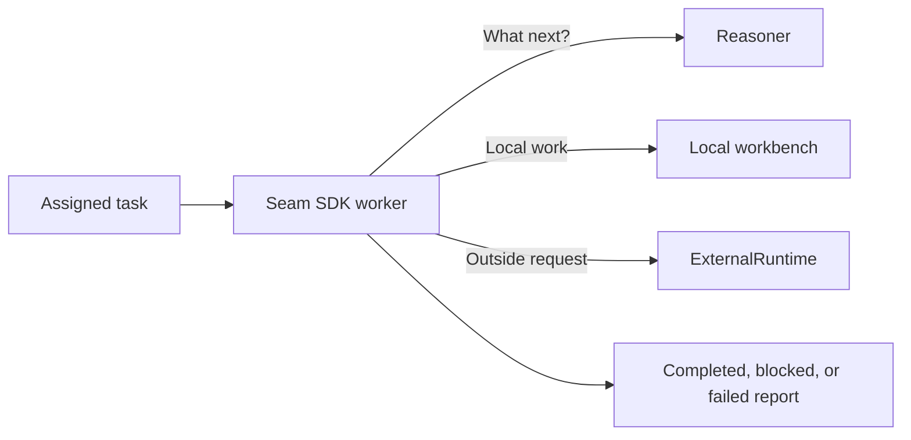
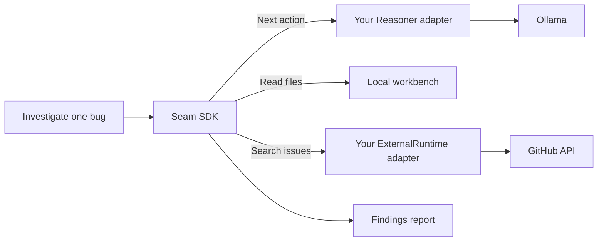
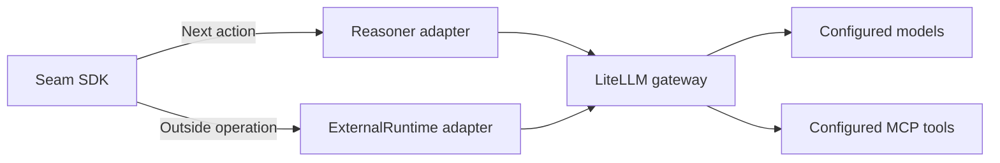
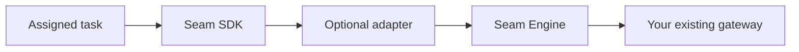

# Seam SDK



**A small worker for one clearly defined job.**

Seam SDK is a minimal Rust runtime for bounded, task-scoped AI workers. You give a worker an assignment, a local workspace, and limits. It takes a bounded number of steps, sees a bounded history of observations, and returns a report. It has no durable or global memory by default.



The two outward connections have different jobs. `Reasoner` decides the next worker action. `ExternalRuntime` carries out something outside the local workbench. You provide their implementations; the SDK does not choose a model or tool provider.

## What the SDK gives you

| Part | Plain-language role |
| --- | --- |
| Task and worker identity | Define the job and identify the worker; the caller assigns the identity |
| Worker loop | Keep the job within step and observation limits |
| Local workbench | Work with permitted files and processes inside the assigned workspace |
| `Reasoner` port | Ask your inference system what action comes next |
| `ExternalRuntime` port | Ask your external system to perform an outside operation |
| Worker report | Return a result that distinguishes task failure from runtime failure |

## Try it without infrastructure

The included [standalone example](examples/standalone.rs) uses fixture implementations. It needs no gateway, credentials, or Seam Engine.

```sh
git clone https://github.com/Judge-M/Seam-SDK.git
cd Seam-SDK
cargo test --all-targets
cargo run --example standalone
```

Expected summary: `Fixture issue inspected`. The [ports](src/ports.rs) are the starting point for your own adapters.

## Ways to connect it

These are **integration patterns**, not bundled product connectors. You implement the two SDK ports for the infrastructure you already use.

### 1. Local model and a repository service

A coding worker could use a `Reasoner` adapter to [Ollama](https://docs.ollama.com/api/openai-compatibility), while an `ExternalRuntime` adapter searches issues through the [GitHub API](https://docs.github.com/en/rest/issues/issues). Local file inspection stays in the SDK workbench.



### 2. One existing gateway for both connections

If your team already uses a unified gateway such as [LiteLLM](https://docs.litellm.ai/docs/), both SDK ports can use it through separate adapters. LiteLLM can handle model requests and [MCP tools](https://docs.litellm.ai/docs/mcp), while the worker still treats “decide my next step” and “do this outside operation” as different requests.



### 3. Add Seam Engine when you need semantic routing

The [optional combined example](https://github.com/Judge-M/Seam/tree/main/examples/combined) implements both SDK ports through an adapter to [Seam Engine](https://github.com/Judge-M/Seam-Engine). Engine resolves trusted authority and chooses a sanctioned semantic capability before the existing gateway executes it. The SDK itself has no Engine dependency.



## Safety boundary

The SDK checks workspace-relative paths and symlink targets, applies both deployment limits and per-task local permissions, clears ambient environment variables for child processes, and caps observations and output. The worker cannot assign itself a trusted identity or grant itself external authority.

The local workbench is **not a full operating-system sandbox**. A deployment that allows process execution must provide its own isolation and network controls. An `ExternalRuntime` implementation must check external authority against trusted grants; a worker's task alone is not proof of permission.

Seam SDK does not provide an AI gateway, model routing, a tool gateway, a capability decision engine, or durable global memory. Bring your own inference and external infrastructure. For the wider design, see the [Seam architecture](https://github.com/Judge-M/Seam).

Licensed under Apache-2.0. See [LICENSE](LICENSE).
